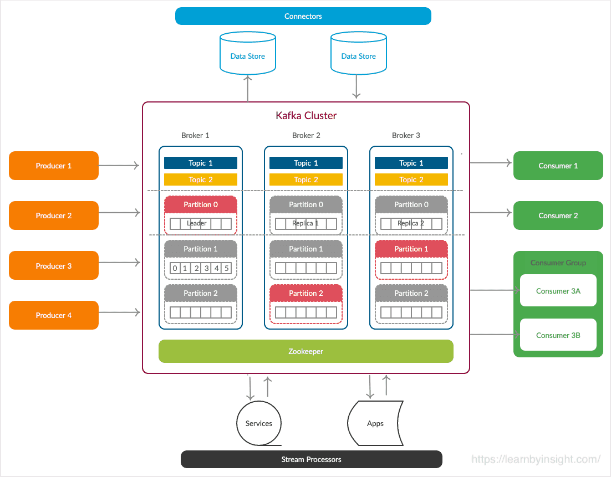
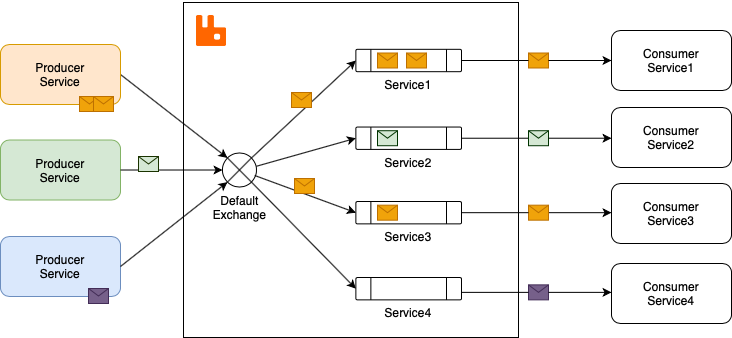
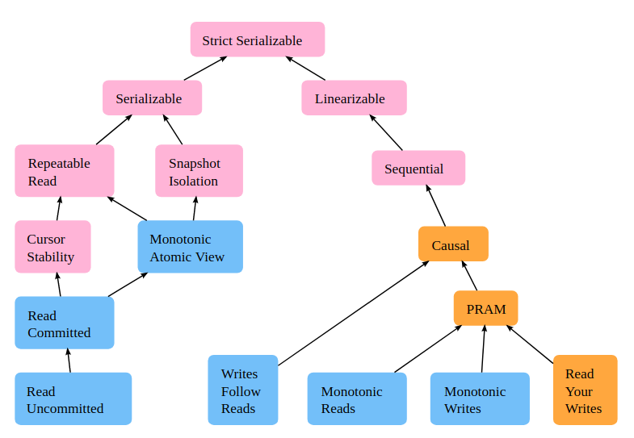
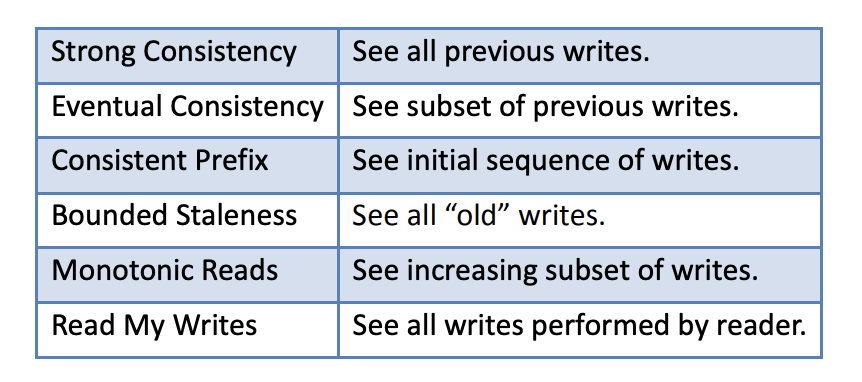
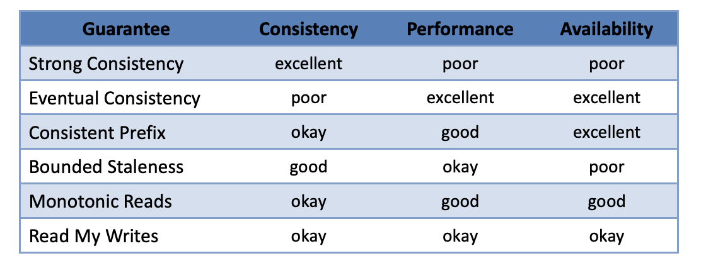
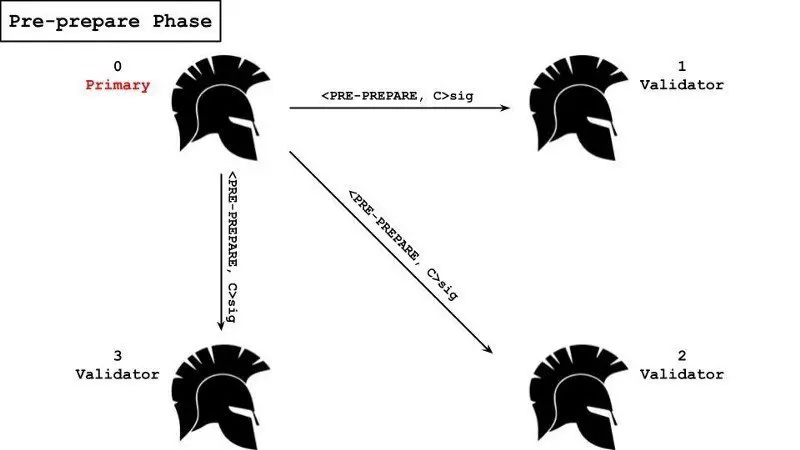
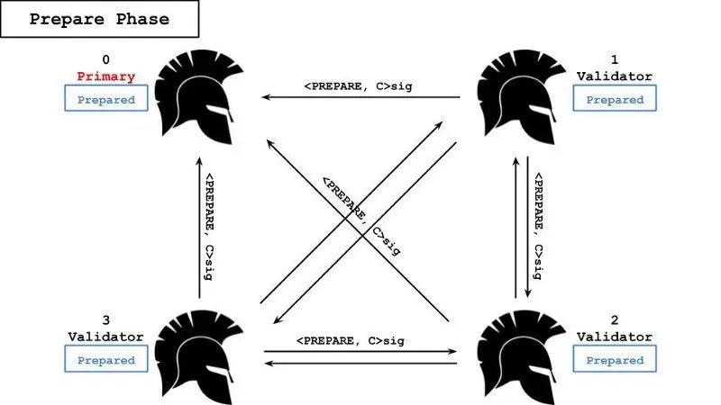

_Distributed System — computer system whose components are located on different networked computers, which communicate and coordinate their actions by passing messages to one another from any system_

_Main reasons to build distributed systems are: Parallelism, Fault Tolerance, Business Demand (banking), Security_

# Inter-Process Communication

* Inter-Process Communication (IPC) — mechanisms an operating system or other enviornments provide to allow the processes to manage shared data
* Approaches
  * File
  * Communications file
  * Signal (also Asynchronous System Trap)
  * Socket
  * Unix domain socket
  * Message queue
  * Anonymous pipe
  * Named pipe
  * Shared memory
  * Message passing
  * Memory-mapped file

## Message Passing

* Message Passing — technique for invoking behavior on a computer through sending messages
* Model
  * One-Way
  * Request-Reply
* Way
  * Push
  * Pull
* Coupling
  * Direct communication — communication when processses know about each other
  * Indirect communicaiton — communication when processes don't know about each other, and it's performed via an intermediary
    * Space uncoupling: processes doesn't know each other's identity
    * Time uncoupling:  processes have independent lifetimes
* Blocking
  * Synchronous communication: process perform operations related to communication blocking itself
  * Asynchronous communication: process perofrm operations related to communication without being blocked
* Channel
  * Reliable
  * Unreliable

## Direct Communication

### API

* API (Application Programming Interface) — a type of software interface, offering a service to other pieces of software

#### REST API

* REST API (Representational State Transfer API) — a software architectural style that was created to guide the design and development of the architecture for the World Wide Web
* Benefits
  * Scalable
  * Uniform Interface
  * Cachable
  * Flexible (to change inner implementation)
  * Compatible
  * Simple to use
* Drawbacks
  * Lack of state
  * Security (REST doesn't impose security)
* Best Practices
  * Organized around resources ('/orders' + POST instead of '/view-order' or '/create-order')
  * Entities are grouped into collecitons ('/orders' instead of '/order/all')
  * Parametrized URLs for identity ('/orders/{order_id}' instead of '/orders?order_id=1')
  * Keep URLs simple ('/orders' instead of '/user/{user_id}/orders')
  * Use query params for additional options or metadata (sort, limit ,etc)
  * Use hyphens in URLs instead of underscores or anything else ('/video-content' instead of 'video_content', 'videocontent')

* Versioning

  | Method           | Example                 | Cache-Friendly | RESTFUL |
  | ---------------- | ----------------------- | -------------- | ------- |
  | via URI          | '/v2/...                | YES            | NO      |
  | via query params | ...?version=2           | YES            | NO      |
  | via headers      | api-verison=2           | NO             | YES     |
  | via media type   | application/xxx.v2+json | NO             | YES     |

#### RPC API

* RPC (Remote Procedure Call) — event when process causes a procedure to execute in a different address space (commonly on another computer on a shared network), which is coded as if it were a normal (local) procedure call, without the programmer explicitly coding the details for the remote interaction

## Indirect communication

* Indirect communication — communication through a broker or an abstraction without direct coupling sender and recipient by messaging
  * Types of coupling
    * space coupling: processes have information about each other
    * time coupling: processes run together
* Types
  * Transient communication: nodes do not store message, message is dropped if recipient is unavailable
  * Persistent communication: messages is stored until recipient receive it
* Models
  * Group communication
  * Message Queue
  * Publish-Subscribe
  * Shared Memory

### Group Communication

* Group Communication — communicaiton with the participation of the group of processes
* Group Structure
  * Egalitarian: decisions are determined collectively
  * Hierarchical: decisions are determined by the coordinator 
* Types
  * Unicast: sender communicates with a single process in system
  * Multicast: sender communicates with a designated group of processes in system
  * Broadcast: sender communicates with every process in system
  * Anycast: sender communicates with one random chosen process in system
* Ordering
  * No order: messages are delivered in unknown order
  * FIFO: messages are delivered in the order in which they were sent from specific member
  * Causal: messages are delivered when all messages, which were recived by sender, are received by receiver
  * Total: messages are delivered in the same order to every group member

#### Multicast

##### Basic Multicast

* Basic Multicast (aka best-effort multicast) — network protocol that provides sequence of packets to multiple recipients simultaneously with weak guarantees, commonly uses point-to-point channel
* Properties
  * No Duplication (working process delivers $m$ no more than once)
  * No Creation (if working process deliver $m$ then $m$ was multicast by some process)
  * Validity (if working process multicast $m$ then $m$ will be eventually delivered by every working process)

##### Reliable Multicast

* Reliable multicast — network protocol that provides a reliable sequence of packets to multiple recipients simultaneously
* Properties
  * No Duplication (working process delivers $m$ no more than once)
  * No Creation (if working process deliver $m$ then $m$ was multicast by some process)
  * Validity (if working process multicast $m$ then $m$ will be eventually delivered by every working process)
  * Agreement (if a working process delivers $m$ then all group working processes in group $g$ will deliver $m$)
* Additional Properties
  * Uniform Agreement (if a process delivers $m$ then all group working processes in group $g$ will deliver $m$)
* Implementations
  * Eager Reliable Multicast
  * Gossip
  * Lazy approach + Failure detector
  * IP Multicast + Acknowledges

###### Eager Reliable Multicast

* Eager Reliable Multicast — protocol with peer-to-peer communication in which every message receiver disseminate it to others

* Complexity: $O(N^2)$ messages

###### Gossip

* Gossip — protocol with peer-to-peer communication that is based on the way epidemics spread (commonly every message receiver disseminate it to other $k$ random nodes every round)
* Complexity: $O(\log N)$ rounds
* Model
  * Push (nodes disseminate information)
  * Pull (nodes ask for information)
  * Push+Pull (nodes do both)
* Modifications
  * Node stop disseminating information with probability $p_{stop}$ if other node to which it was sent already has it

#### Overlay Network

* Overelay Network — virtual or logical network that is created on top of an existing physical network
* Topology
  * Star
  * Mesh
  * Full Mesh
  * Bus
  * Linear
  * Ring
  * Tree

### Message Queue

* Message Queue — software components used for inter-process communication (IPC) providing asynchronous communication protocols to allow sender and receiver to communicate remotely and at different times
* Benefits
  * +Resource Utilization (no component in the system is every stalled waiting for another, optimizing data flow)
  * +Reliability (if one side failed, other side can continue working)
  * +Flexibility (scale on demand)
  * +Simplicity (no need to design communication)
* Drawbacks
  * +Latency
  * +Deployment
  * +Cost
* Features
  * Durability (store messages in memory / disk / DBMS)
  * Security Policies (access to messages)
  * Message Purging Policies (message's TTL)
  * Message Filtering (subcriber may only see messages matching some criteria)
  * Delivery Policies (at least once or another guarantee)
  * Routing Policies (which queues should receive message, which servers should receive queue's message)
  * Batching Policies (deliver message immediately or wait and deliver many at once)
  * Queuing Criteria (when message is considered "enqueued")
  * Receipt Notification (publisher may know whether subscriber received message or not)
* Usage Examples
  * Asynchronous message exchanging
  * Dispensing tasks between workers
* Examples
  * Enterprise
    * IBM MQ, Java Message Service (JMS)
  * Advanced Message Queuing Protocol (AMQP)
    * RabbitMQ, Apache ActiveMQ, Apache Qpid
  * Task/Job Queues
    * Gearman, Redis
  * Cloud Services
    * Amazon Simple Queue Service, Yandex Message Queue

#### AMQP

* AMQP (Advanced Mesaged Queuing Protocol) — an open standard application layer protocol for message-oriented middleware
* Features
  * Targeted QoS
  * Persistence
  * Multiple consumers
  * High speed

##### Specifications

[AMQP Specifications](https://www.rabbitmq.com/protocol.html)

###### Frame

* Types
  * Method frame
  * Content Header frame
  * Body frame
  * Heartbeat frame

* Structure

  1. Frame Type

  2. Channel #

  3. Size

  4. Payload
     1. Class
     2. Method

  5. End-byte marker

#### Apache Kafka

* Apache Kafka — a distributed event store and stream-processing platform

* Benefits

  * Scalability (using partitions)
  * Low Latency (upto 10ms)
  * High Throughput (>1000 messages/s)
  * Fault Tolerance (messages are stored on disk)
  * Durability (replication feature)
  * Simple Integration (each consumer/producer should be aware of Kafka and not about other participants of the system)
  * Batch Approach, Can Work as ETL

* Drawbacks

  * No complete set of monitoring and managing tools
  * No support for balancing data across nodes (uneven record distribution)
  * No inflight modification of messages
  * No point-point or request/reply paradigms

* Features

  * Streams API (processing data inside kafka, e.g. grouping - group by)
  * Consumer's offsets for each partition are stored in special topic called Consumer offset
  * Retention Policy (globally or per topic)
  * Delivery Guarantees (At most once, At lease once, Exactly once; Exactly once is actually impossible, but with this guarantee you process each message only once)
  * Consumer groups + auto load balancing + auto rebalance (it's a single consumer for Kafka but having multiple nodes to distribute load, so Kafka assigns different partitions to different topics)
  * Compacted topics (for each key store only last received value)
  * Security features (optional)

* Problems

  * Uneven record distribution (Kakfa doesn't aware of partitions' sizes, so you need to balance data by yourself)

    [Challenge of uneven record distribution](https://aiven.io/developer/balance-data-across-kafka-partitions#challenge-of-uneven-record-distribution)

    * Solution:
      * Default partitioning: change settings for "linger time" and a maximum size of the batch
      * Partitioning by key: no off-the-shelf approach

##### Architecture

##### Stream Processing

Approahces from the most simple to the mose flexible

1. KSQL (ksqlDB)
2. Kafka Streams API
3. Producer/Consumer

#### RabbitMQ

* RabbitMQ — an open-source message-broker software (sometimes called message-oriented middleware) that originally implemented the Advanced Message Queuing Protocol (AMQP) and has since been extended with a plug-in architecture to support Streaming Text Oriented Message Protocol (STOMP), MQ Telemetry Transport (MQTT), and other protocols
* Benefits
  * Flexibility in Messaging Patterns and Routing
  * Reliability
  * Durability
  * Scalability
  * Simplicity
  * Security
  * Monitoring UI

* Drawbacks
  * Higher Latency
  * Resource Intensity
  * Difficult to Scale, Complex Configuration (for cluster)
  * Difficult to Preserve Message Ordering Guarantees

* Features
  * Supports request/reply paradigm
  * Flexible routing (exchange to exchange routing)

##### Architecture

##### Exchange

* Exchange — RabbitMQ's component that receives messages from producers and pushes them to corresponding queues

* Types
  * Default (uses queue name)
  * Direct (uses exact match)
  * Topic (uses wildcards)
  * Consistent Hashing (distributes evenly)
  * Headers (uses headers)
  * Alternate (used for unrouted messages from previous exchange)
  * Dead letter (used for "dead-lettered" messages)

#### Apache Kafka vs RabbitMQ

| Aspect               | Apache Kafka                                                 | RabbitMQ                                         |
| -------------------- | ------------------------------------------------------------ | ------------------------------------------------ |
| **Type**             | Distributed Streaming Platform                               | Message Broker                                   |
| **Message Model**    | Publish-Subscribe, Log Storage                               | Message Queues, Publish-Subscribe, Request/Reply |
| **Performance**      | High throughput and low latency                              | Good throughput, may have higher latency         |
| **Persistence**      | Supports disk-based retention for messages                   | Messages can be persisted to disk                |
| **Scalability**      | Designed for horizontal scalability                          | Scales horizontally, but may require more nodes  |
| **Protocol Support** | Supports Kafka Protocol (binary)                             | Supports multiple protocols (AMQP, MQTT, etc.)   |
| **Security**         | SSL/TLS, SASL, ACLs, Integration with external authentication providers | SSL/TLS, LDAP, OAuth, Custom Plugins             |
| **Management UI**    | Third-party tools like Confluent Control Center              | Management UI available                          |
| **Ecosystem**        | Kafka Streams, Connect, ksqlDB                               | Wide range of plugins and extensions             |
| **Fault Tolerance**  | Data replication, leader-follower model                      | Mirroring, HA queues, Clustering                 |
| **Monitoring**       | JMX metrics, third-party monitoring tools                    | Management and monitoring plugins available      |

### Publish-Subscribe

* Publish-Subscribe — messaging pattern where senders of messages, called publishers, do not program the messages to be sent directly to specific receivers, called subscribers, but instead categorize published messages into classes without knowledge of which subscribers, if any, there may be. Similarly, subscribers express interest in one or more classes and only receive messages that are of interest, without knowledge of which publishers, if any, there are
* Usage examples
  * Financial Systems
  * Collaborative Editing
  * Monitoring
  * Asynchronous message exchanging

* Filtering Options
  * Channel-based
  * Subject-based (metadata inside message)
  * Content-based
  * Type-based (type of events)
  * Specific message
  * Context (e.g. messages from the same location)
  * Complex event processing

### Shared Memory

* Shared Memory — memory that may be simultaneously accessed by multiple programs with an intent to provide communication among them or avoid reduntant copies

#### Distributed Shared Memory

* Distributed Shared Memory — form of memory architecture where physically separated memories can be addressed as a single shared address space
* Benefits
  * +Speed (relative to other IPC methods)
  * User-Friendly interface for developer (arguably)
* Drawbacks
  * -Scalability
  * Low Isolation (of processes)
  * Require Synchronization Primitives
  * Not Portable
  * Hidden Overhead Cost
  * False Sharing
  * Thrashing

# Failure Detection

## Definitions

* Fault — malfunction in system's component that is the reason of error
* Error — problem with system's component inner state that can lead to failure
* Failure — externally visible system's problem
* Fault-tolerance — system's property to continue operating properly even in the presence of faults within some of its components

## Fault

* Reasons
  * Hardware
  * Network
  * Software
  * External Factors
* Types
  * Temporary
  * Periodic
  * Permanent

## Failure

* Types
  * Crash — system stopped working
    * Crash-Stop
    * Crash-Recovery
  * Omission — system skips some of actions
  * Timing — system breaks the working time guarantees
  * Response — system responds incorrectly

## Failure Detector

* Failure Detector — component that monitors processes' status
* Metrics
  * Completeness — share of failed processes that are suspected
    * Strong — every failed process should be suspected by _every_ failure detector
    * Weak — every failed process should be suspected by _some_ failure detector
  * Accuracy — share of unsuspected correct processes
    * Strong — no correct process is suspected
    * Weak — some correct process is never suspected
    * Eventual — strong or weak accuracy eventually
  * Detection Time — metrics on distribution of failure detection's time
  * Load
  * Network Load

## Approaches

### Simple

* Algorithm
  * Periodically ping every process
  * Suspect process if it didn't respond within the time $T_{suspect}$ after ping
  * If afterward suspected process respond on ping then it becomes unsuspected

### Heartbeat (all-to-one)

* Complexity
  * Number of messages: $O(N)$
  * Network traffic: $O(N)$
  * Load: $O(1/T)$

* Algorithm
  * Every process periodically sends its state to main process

### Heartbeat (all-to-all)

* Complexity
  * Number of messages: $O(N^2)$
  * Network traffic: $O(N^2)$
  * Load: $O(N/T)$
* Algorithm
  * Every process periodically sends its state to all other processes

### No Timeout

* Algorithm
  * Every process stores list of neighbours and counters of received neighbours' state
  * Every process periodically sends its state to neighbours
  * On receiving other's state process updates counter and sends state to other neighbours
  * Failure detector shows counters without any interpretation

### Gossip-Style

* Complexity

  * Message size: $O(N)$

  * Number of messages: $O(N\log N)$
  * Network traffic: $O(N^2\log N)$ 
  * Load: $O(N\log N/T)$

* Algorithm

  * Every process stores membership list with heartbeat counter and last update time
  * Processes periodically gossip their membership list
  * On receiving other's membership list, the local membership list is updated
  * If no message by some process within time $T_{suspected}$ then this process is suspected
  * If process is suspected within time $T_{fail}$ then this process is removed from membership list

### SWIM

* Properties
  * Completeness
  * High accuracy (it growths exponentially with $K$)
  * Scalability
  * Time of failure detection doesn't depend on $N$
* Complexity
  * Number of messages (avg): $O(N)$
  * Network traffic (avg): $(N)$
  * Load (avg): $O(N/T)$
* Algorithm
  * Every process periodically ping other random process
  * If no response received from process $P$ within time $T_1$ then process ping other $K$ random processes asking to ping $P$
  * If still no response about process $P$ then $P$ is failed and removed from membership list

### $\varphi$ Accural Detector

* Algorithm uses statistics for determining $T_{fail}$

### FALCON

_Fast And Lethal Component Observation Network_

* Algorithm kills process that is counted as failed

### Panorama

* Algorithm uses all communication messages between processes for determining state of process

# Naming and Search

## Address

* Address — kind of object's name that represents its place in network
* Properties
  * Object can have multiple addresses
  * Address can be changed
  * Address can be assigned to another object
  * Address usually has fixed size
  * Address are human-unfriendly

## ID

* ID — kind of object's name that identifies it

* Properties

  * ID refers to no more than one object
  * Object has no more than one ID
  * ID always refers to single object
  * ID doesn't depend on object's address

  * ID can be human-friendly (e.g. domain)

## Naming Structure

* Naming Structure — way of defining relationships between names
* Types
  * Flat
  * Hierarchical
  * Attribute-Based

## Name Resolution

* Broadcast/Multicast
* Table (_name_,_address_)
  * One responsible node stores table
  * Every node stores table
  * Every node stores partial table

## DNS

### Name Resolution

* Iterative
* Recursive
  * Benefits
    * Caching (DNS server caches results)
    * Locality (DNS servers may stay far from user but close to each other)
  * Drawbacks
    * Root DNS Server's Load
* Hybrid (is used in real)
  * Recursive query to local DNS server (usually owned by provider)
  * Iterative query from local DNS server to root and other DNS servers

### Caching

* Server stores DNS records that was received from other servers

### Replication

* DNS zone has primary and secondary servers

## DHT

* DHT (Distributed Hash Table) — distributed system that provides a lookup service similar to a hash table: any participating node can efficiently retrieve the value associated with a given key
* Benefits
  * Nodes can be added or removed with minimum work around re-distributing keys

### Chord

* Chord — protocol for a peer-to-peer DHT
* Complexity
  * Space
    * $O(\log N)$ for every node
  * Time
    * $O(\log N)$ — key' search
    * $O(\log^2 N)$ — keys rearrangement on adding/removing nodes

## DNS vs DHT

* DNS

  * Nodes' responsibles are companies

  * Hierarchical structure
  * Caching

* DHT

  * Nodes' are peers
  * More resistant to attacks (because nodes are peers)

# Scaling

* Scaling — process of increasing scalability
* Scalability — property of a system to handle a growing amount of work by adding resources to the system
* Types
  * Vertical Scaling — process of enhacing system's performance by upgrading the capacity of a single machine
    * Simple implementation, but expensive and limited

  * Horizontal Scaling — process of enhancing system's performance by adding more machines
    * Complex implementation, but cheaper, more efficient and fault-tolerant

## Reverse Proxy

* Reverse Proxy — web server that centralizes internal services and provides unified interfaces to the public
* Benefits
  * +Security (hide information about backend servers, blacklist IPs, limit number of connections per client)
  * +Scalability (clients only see the reverse proxy's IP, allowing scaling servers or changing their configuration)
  * +Flexibility (clients only see the reverse proxy's IP, allowing scaling servers or changing their configuration)
* Drawbacks
  * +Latency
  * +Complexity
  * Single point of failure
* Additional features
  * SSL termination (decrypt incoming requests and encrypt responses, no need to have X.509 certificate on each server)
  * Compression
  * Caching
  * Serving static content

## Service Replication

* Service Replication — approach of running multiple instances of a single service

### Fail-Over

* Fail-Over — approach when service can survive failure of nodes by replacing them with anothers

#### Active-Passive Fail-Over

_aka master-slave failover_

* Active-Passive Fail-Over — approach when passive server on stanby checks if active server is available and in case of failure it takes over its IP address and resumes service

#### Active-Active Fail-Over

_aka master-master failover_

* Active-Active Fail-Over — approach when all servers are managing traffic, spreading the load between them

### Load Balancing

* Load Balancing — process of distributing a set of tasks over a set of resources, with the aim of making their overall processing more efficient
* Benefits
  * Increased Read/Write Throughput
  * Fault-Tolerance
* Drawbacks
  * Complexity
  * Overhead
  * (Dynamic Algorithms) Increased Network Load

* Implementation
  * Hardware
  * Software
  * via DNS
  * Client-Side

* Types
  * Layer 4 (connection/session)
  * Layer 7 (application)

#### Algorithms

* Types
  * Static — algorithms that do _not_ take into account the state of different machines
  * Dynamic —  algorithms that take into account the state of different machines

##### Static

* Random
* Round Robin
* Hash
* Power of Two Choices

##### Dynamic

* Least Connections
* Least Time

##### via DNS

* Round-robin DNS
* DNS delegation

## Caching

* Benefits
  * Increased Read Throughput
  * Decreased CPU/GPU Load
  * Decreased Network Load
* Drawbacks
  * Complexity (cache invalidation)
  * Update Delay
  * Expensive
* Implementations
  * Client-Side
  * Intermediate Caching Proxy-Servers
  * CDN (Content Delivery Network)
  * Caching HTTP Reverse Proxy (Nginx, Varnish)
  * Caching Storage (Redis, memcached)

* Algorithms

  * LRU (Least Recently Used)
  * LFU (Least Frequently Used)
  * LFRU (Least Frequently Recently Used)
  * FIrst In First Out

  According to Twitter: <a href="https://www.usenix.org/conference/osdi20/presentation/yang">FIFO works the best for a large number of workloads</a>

  According to research: <a href="http://www.sce.carleton.ca/courses/sysc-5801/chlung/own%20papers/LargeFileCaching.pdf">LRU performs the best based on the data collected in our experiments (Experiments of Large File Caching and Comparisons of Caching Algorithms)</a>

* Cache Invalidation: TODO:

## Sharding

* Sharding — hirozontol partitioning of data in a database or search engine
* Benefits
  * Increased Read/Write Throughput
  * Increased Storage Capacity
  * High Availability
* Drawbacks
  * Complexity
  * Expensive
  * (Geosharding) Susceptible to performance degradation due to excessive network traffic
  * (DB) More expensive JOIN operations
* Use Cases
  * Database
  * Search Engine
  * Cache

### Vertical Sharding

* Vertical Sharding — sharding that splits data by column sets

### Horizontal Sharding

* Horizontal Sharding — sharding that splits data by row sets

* Algorithms
  * Ranged/Dynamic Sharding — sharding that chooses appropriate shard depending on value of record's field using value ranges
  * Algorithmic/Hashed Sharding — sharding that chooses appropriate shard depending on output of algorithm or hash function
  * Entity-/Relationship-Based Sharding — sharding that chooses appropriate shard depending on record's relationships (e.g. user payment transactions would be stored together)
  * Geography-Based Sharding (Geosharding) — sharding that chooses appropriate shard depending on record's geography

## Database Index

* Database Index — data structure that improves the speed of data retrieval operations on a database table at the cost of additional writes and storage space to maintain the index data structure

## Message Queue

<a href="#Message Queue">Message Queue</a>

## Parallel Computing

* Parallel Computing

* Classes
  * Single Instruction, Multiple Data (SIMD)
    * Examples: SIMD CPU's instructions, GPU
  * Multiple Instruction, Multiple Data(MIMD)
    * Examples: Systems with shared memory, Systems with distributed memory, Hybrid systems
* Systems Examples:
  * Massively Parallel Processing (MPP)
  * Beowulf Cluster
  * HPC cluster

### Map-Reduce

* Map-Reduce — programming paradigm that enables massive scalability across hundreds or thousands of servers in a Hadoop cluster
* Benefits
  * +Simplicity
  * +Efficiency (CPU Utilization, Performance)
* Drawbacks
  * Not every task can be described as Map-Reduce job
  * Not efficient for small dataset / Big overhead relative to small dataset
* Implementation Examples:
  * Google
  * Apache Hadoop
  * Apache Spark
  * YTsaurus

### Scatter/Gather Pattern

* Scatter/Gather Pattern — tree pattern with a root node that distributes requests and leaves that process those requests. Each replica does a small amount of processing and then returns a fraction of the result to the root
* Usage examples
  * Distributed search

### Tail Latency

* Tail Latency — high percentile latency (e.g. latency of requests with response time longer than 99% of all requests)
* Strategies to decrease Tail Latency
  * Degradation (fast response with worse quality)
  * Hedging
  * Tied requests (same request on multiple servers)
  * Additional replicas for hot data
  * Temporary exclusion of slow machines

# Data Replication

* Data Replication — approach of storing the same data on multiple storage devices

* Benefits

  * +Availability
  * +Reliability
  * +Read/Write Throughput
  * -Latency (in case of geo-distributed replication)

* Drawbacks

  * +Complexity
  * +Cost
  * Database Coupling

* Types

  * By user's request processing

    * Active: every replica process client's request

    * Passive: only one replica process client's request and updates others

  * By time coupling

    * Synchronous: client waits until _all_ replicas to be updated
    * Asynchronous: client waits until _subset_ of replicas to be updated

## Replica

* Replica — node in data replication approach
* Type
  * Active — process all requests from clients
  * Passive — process only some of client requests or do not process at all and receive results from active replica

## Consistency

* Data Consistency — property of a system to keep data the same at different places
* Types
  * Eventual Consistency — consistency is reached eventually
  * Strong Consistency — consistency is always met from the client's point of view

### Consistency Tricks

_in case of asynchronous replication_

#### Reading Your Own Writes

* If user is able to modify only small subset of resources then allow user read those resources from leader and rest of them from replicas (e.g. profile in social media)
* If application can suffer a replica lag then measure, for example, 99% percentile of resource replication lag and use it to switch read opeartions to replicas (e.g. 99% percentile of resource replication lag is 200ms then within 200ms after write operation read from leader and since 200ms have passed read from replicas)
* Keep track of most recent update timestamp on client side and send it as a part of read request. Then ensure that replica from which we are reading store data fresh anough according to provided timestamp

#### Monotonic Reads

* Keep track of most recent update timestamp on client side and send it as a part of read request. Then ensure that replica from which we are reading store data fresh anough according to provided timestamp

## Approaches

### Single Leader Replication

_also called as primary-secondary backup, active/passive, leader-follower or master-slave replications_

* Single Leader Replication — data replication with single leader (active replica)
* Benefits

  * +Read Throughput
* Drawbacks

  * +Latency (synchronous mode)
  * Reading stale data (asynchronous mode)
  * Single point of failure

* Examples
  * PostgreSQL
  * MySQL
  * Oracle
  * MongoDB
  * HBase
  * Kafka

#### Workarounds

* Client stores timestamps for read-after-write consistency
* Sticky routing for monotonic read consistency (clients read from the same replica, if it dies, new replica is chosen for reading)
* Quorum and fencing
  * If a network is partitioned into two subsets, the subset with the majority of nodes remains active while shooting the minority subset (this approach is literally called STONITH — Shoot The Other Node In The Head) by sending out a special signal to power supply controller

### Multi Leader Replication

_also called active/active or multi-master replications_

* Multi Leader Replication — data replication with multiple leaders (active replicas)

* Benefits

  * +Distributed Write Load
  * -Latency (in case of geo-distributed replication)
  * Support offline client
* Drawbacks

  * Require leaders coordination (synchronous mode)
  * Require conflict resolution (asynchronous mode)
  * Write order can be broken

* Examples
  * WANdisco
  * CouchDB
  * Google Docs

### Leaderless Replication

* Leaderless Replication — data replication with no leader (every replica is active)

* Benefits

  * +Failure Handling Simplicity
  * +Availability
* Drawbacks

  * -Consistency Maintenance Simplicity
  * Discrepancies can appear
  * Require conflict resolution

* Examples
  * Dynamo
  * Riak
  * Cassandra
  * Voldemort
* Configuration
  * $N$ — number of nodes, $R$ — read quorum size, $W$ — write quorum size
  * $W + R > N$ — reading only up-to-date records
  * Setups
    * $N$ — odd is preferred (look at Fault-Tolerance section)
    * $W = R = (N + 1) / 2$ — balanced setup
    * $W = N$, $R = 1$ — read optimized setup
  * Fault-Tolerance
    * $W < N$, $R < N$
    * $N = 3$, $W = 2$, $R = 2$ — 1 node can fail
    * $N = 4$, $W = 3$, $R = 2$ — 1 node can fail
    * $N = 5$, $W = 3$, $R = 3$ — 2 nodes can fail
  * Additional mechanisms
    * Read Repair — updating stale data and conflict resolution on read operation
    * Anti-Entropy — background process which compares states from replicas and resolves conflicts
    * Hinted handoff — failed node will be temporarily replaced with another one
    * Sloppy quorum — replacement nodes are counted _multiple_ times to quorum size (operations can be served even if number of available replicas is less than quorum size)
    * Strict quorum — replacement nodes are counted _once_ to quorum size

## Conflict Resolution

### Activating

* On read operation
* On write operation

### Policy

* Last Write Wins (LWW)
* Vector Clocks
  * Vector Clock — data structure used for determining the partial ordering of events in distributed system and detecting causality violations
  * Benefits
    * +Causality
  * Drawbacks
    * -API Simplicity
    * +Memory Usage
  * [Why Vector Clocks Are Hard](https://riak.com/posts/technical/why-vector-clocks-are-hard/)
* Application Specific Procedure (including case of client's interaction)
* Conflict-Free Replication Data Types (CRDT) (when order doesn't matter)

## Q&A

* What are advantages and disadvantages of synchronous replication compared to asynchronous?
  * Advantages
    * It's guaranteed that all replicas store up-to-date data
    * no need for conflict resolution
  * Disadvantages
    * works slowly
    * can't write if one replica disabled
* What is replication strategy for Google Docs?
  * Several leaders
    * one leader – big delay, especially in presence of network partition
    * no leader – big delay, especially if there are some of replicas in other region
  * Asynchronous replication
    * synchronous replication - big delay, especially in presence of network partition
* What are disadvantages of LWW?
  * Clock drift causes wrong results of operations
  * No conflict resolution logic
* What is a difference between vector clock and Lamport Clock?
  * Lamport clock doesn't respect causality
* What is example of usage of vector clocks?
  * Questions and replies in messanger's chats require causality

# Consistency

* Data Consistency — property of a system to keep data the same at different places

## Consistency Models

* Consistency model — contract between the programmer and a system, wherein the system guarantees  that if the programmer follows the rules for operations in memory, memory will be consistent and the results of reading, writing, or updating memory will be predictable

### Linearizable

* Linearizable consistency — consistency model that meets requirements of linearizability
* Linearizability — one of the strongest single-object consistency models which implies that every operation appears to take place atomically, in some order, consistent with real-time ordering of those operations
* Linearizability (more formal) — consistency model which provides history H that is equivalent to sequential history S, and the partial real-time order of operations in H is consistent with the total order of S, and which preserves the object's single-threaded semantics
* Benefits
  * Real-time constraints (system works like single-threaded process)
  * +Development Simplicity
* Drawbacks
  * Can't be totally or sticky available
  * In the event of a network partition, some or all nodes will be unable to make progress

### Eventual Consistency

_aka optimistic replication_

* Eventual consisteny — consistency model which informally guarantees that, if no new updates are made to a given data item, eventually all accesses to that data item will return the last updated value
* Benefits
  * +Availability
  * +Performance
  * +Scalability
  * In the event of a network partition any node is able to make progress
* Drawbacks
  * -Development Simplicity
  * +Conflict Resolution
  * -Safety (formally, an eventually consistent system can return any value before it converges)

### Conflict Resolution

* Conflict Resolution — process of reconciliation of differences between multiple copies of distributed data
* Types
  * Read repair (correction is done when a read find inconsistency)
  * Write repair (correction takes place during a write operation)
  * Asynchronous repair (correction is not part of a read or write operation)

### Strong Eventual Consistency

* Strong Eventual consisteny — eventual consistency model with additional safety guarantee: "any two nodes that have received the same (unordered) set of updates will be in the same state"
* Benefits
  * +Availability
  * +Performance
  * +Scalability
  * In the event of a network partition any node is able to make progress
* Drawbacks
  * -Development Simplicity

### Comparison

#### Overall

#### Linearizability vs Serializability

[Linearizability versus Serializability](http://www.bailis.org/blog/linearizability-versus-serializability/)

#### Linearizability vs Sequential Consistency

Linearizability cares about time. Sequential consistency cares about program order. – Should provide the behavior of a single copy – A read operation returns the most recent write, regardless of the clients. – All subsequent read ops should return the same result until the next write, regardless of the clients.

## Clock

* Clock — mechanism for capturing relationships of events in distributed systems

### Clock Drift

* Clock Drift — phenomena where a clock doesn't run at exactly the same rate as a reference clock 

### Physical Clock

* Physical Clock — clock that uses number of elapsed seconds to determine relationships
* Examples
  * Quartz clock
    * Cheap
    * High clock drift (about 10-25 minutes per year)
  * Atomic clock
    * Expensive
    * Small clock drift (about 1 second per 3M years)
    * Used in GPS

### Logical Clock

* Logical Clock — clock that captures chronological and causal relationships

* Algorithms
  * Lamport timestamp
  * Vector clocks
  * Version vectors
  * Matrix clocks

# Consensus and Related Problems

## Consensus

* Consensus — algorithm allowing nodes of a system to agree on some data value that is needed during computation

* Implementation examples
  * Raft
  * Paxos

## Related Problems

* Examples of real life problems
  * Every user has unique username
  * Account balance shoud be non-negative
  * Number of items in stock should be non-negative
  * Replicated storage should support linearizability
  * Transaction should be completed entirely
* Approaches
  * Single server: locks, atomic operations
  * Distributed system: leader, lock service, transactions coordinator, atomic broadcast, consensus

### Two-Phase Commit (2PC)

_aka two-phase commit protocol_

* Two-Phase Commit — type of atomic commitment protocol
* Benefits
  * Atomicity
  * Tolerates process, network node, communication, etc. failures (temporary)
* Drawbacks
  * Don't tolerate infinite failure (if node crashes forever)
  * Requires stable storage at each node with write-ahead log
    * Stable storage — storage that guarantees atomicity for any given write operation and allows software to be written that is robust against some hardware and power failures
  * Network communication should support rerouting

## Paxos

* Paxos — a family of protocols for solving consensus in a network of unreliable or failible processes

* Benefits
  * Throughput (~1000 tx/s)
  * Latency (~1s/tx)
  * Energy usage
  * Scalable
  * Decentralized
  * Flexible (can be used in various distributed systems)
  * Industry proven
* Drawbacks
  * Difficult to implement
  * Lot of Communication (require many rounds of communication)
* Assumptions
  * Processors
    * Operate at arbitrary speed
    * May experience failures
    * May re-join the protocol after failures (in case of stable storage)
    * Do not collude, lie, etc (no byzantine failures)
  * Network
    * Processors can send messages to each other
    * Messages are sent asynchronously and may take arbitrary time to deliver
    * Messages may be lost, reordered, duplicated
    * Messages are delivered without corruption (no byzantine failures)

### Byzantine Paxos

* Byzantine Paxos — extension of Paxos which supports byzantine failures (arbitrary failures of the participants , including lying, fabrication os messages, collusion with other participants, selective non-participation, etc)

## Raft

* Raft — a consensus algorithm designed as an alternative to the Paxos family of algorithms

* Benefits
  * Throughput (~1000 tx/s)
  * Latency (~1s/tx)
  * Energy usage
  * Simple implementation
  * Single Round of Communication
  * Clear Leader (reduces chances of inconsistencies)
  * Flexible (modular design)
* Drawbacks
  * Scalability (limited)
  * Performance Overhead
  * Leader bottleneck
  * No liveness guarantee (if leader becomes unavailable)

## Blockchain

#### Proof of Work

* Proof of Work (PoW) — a consensus algorithm which is based on the proving that a certain amount of a specific computational effort has been expended

* Benefits
  * Public
  * Relatively Safe
  * Decentralized
* Drawbacks
  * Throughput (~3-7 tx/s)
  * Latency (~3600s/tx)
  * Energy usage (especially bitcoin)
* Implementations
  * Bitcoin

## Byzantine Fault Tolerance

* Byzantine fault — condition of a computer system, particularly distributed computing systems, where components may fail and there is imperfect information on whether a component has failed

### Algorithm

#### Properties

* $f$ – number of traitors

* $n$ – number of nodes

* $n \ge 3f+1$
* $f+1$ rounds
* $O(N^{f+1})$ messages
* Susceptible to attack to certain nodes (e.g. DoS)

### Algorithm (with signatures)

#### Properties

* $f$ – number of traitors

* $n$ – number of nodes

* $n \ge f+2$
* $f+1$ rounds
* $O(N^2)$ messages

### Practical Byzantine Fault Tolerance

#### Properties

* $f$ – number of traitors

* $n$ – number of nodes

* $n \ge 3f+1$
  * If client receives $n-f$ responses then in an assumption of $f$ slow replicas and $f$ traitors' responses to make the decision of majority we need number of trusted responses $(n-f) - f$ be more than number of traitors $f$, so $n \ge 3f$
* $f+1$ rounds
* $O(N^2)$ messages

#### Phases

_case of 4 generals_

1. Pre-prepare
   * The leader is responsible for receiving the Byzantine cilent's attack/retreat command (request)
   * The leader is responsible for initiating the proposal. The said proposal sent to the replicas shall include the message content (attack or retreat), the view number (correponding uniquely to the leader) and a sequence number, which can be described as the numeral order of the action being undertaken
   * The leader sends the "pre-prepare" messages with his signature to other validators via the messenger (communication protocol)

2. Prepare
   * After each replica receives the "pre-prepare" message, it can either accept or reject the leader's proposal. If the replica accepts the leader's proposal, it will send a "prepare" message with its own signature to all the other replicas (including the leader). If it rejects, it will not send any message
   * The general who issued the "prepare" message enters the "prepare" phase
   * If a replica receives more than $2f+1$ "prepare" messages, it enters the prepared state. The collection of these prepare messages is collectively referred to as the "prepared certificate"

3. Commit
   * If the "prepared" general decides to commit, it will send a "commit" message with the signature to all the generals (replicas). If it decides not to execute, no message is sent
   * The general who issued the "commit" message enters the "commit" phase
   * If the generals receive more than $2f+1$ "commit" messages, the message object is executed, which also means that the proposal has reached a consensus
   * After the execution of the message, the general enters the "commited" state and returns the execution result to the Byzantine client
   * After the reply has been sent, the replicas wait for the next request

#### Leader Replacement

* Each general starts a timer after receiving the "prepare" message, a mechanism that is turned off after switching to the "committed" state
* If the message is not executed within a given maximum amount of time T after the timer has been started, the generals broadcast a "view change" message. This message shall include the new view (current view number +1), and a number of other details
* If the leader fails to broadcast the client's request and start the "prepare" phase, each honest replica will eventually send a view change message upon expiration of the timer
* Upon receiving more than $2f+1$ "view change" messages, the new leader can broadcast a "new view" message to all the replicas. This message shall include the new view number, a proof that the previous request has not been executed, a "prepare" message, and a number of other components
* After receiving the "new view" message, each replica shall follow the three steps of request execution described above, once the new leader broadcasts the client's request
* The new leader is now responsible for broadcasting requests from the Byzantine client

### Applications

* Permissioned (private) blockchains (Hyperledger Sawtooth)
* Protocols (Zyzzyva, Tendermint, HotStuff, LibraBFT)

# Security

## Threats

* Security threat — potential for violation of security, which exists when there is an entity, circumstance, capability, action, or event that could cause harm
* Types
  * interception
  * modification
  * fabrication
  * interruption

* Attack Examples

  * eavesdropping

  * data tampering

  * man-in-the-middle

  * masquerading, spoofing, phishing

  * replaying

  * denial-of-service

  * malware, spyware

## Secure Systems in General

### Requirements

* Privacy
* Integrity
* Authentification
* Impossibility of downtime
* Authorization
* Availability
* Scalability

### Assumptions

* Publicity of interfaces
* Networks aren't secure
* Algorithms and code are available for attackers
* Attackers have big computing capability

### Methodology

* Threats analysis
* Threats prevention
* Validation
* Audit

### Approaches

* Cryptography
* Access Control (authorization, etc)
* Security Management (key, certificates distribution, etc)

## Encryption

* Encryption — process of encoding information
* Types
  * Symmetric: encryption and decryption keys are the same
  * Assymetric: encryption and decryption keys are different
* Examples
  * Symmetric (block cipher)
    * DES
    * 3DES
    * TEA
    * IDEA
    * Blowfish
    * Twofish
    * AES
  * Symmetric (streaming cipher)
    * RC4
  * Assymetric
    * RSA
    * ElGamal
    * ECDSA

### Symmetrics vs Assymetric Encryption

|                  | Symmetric                                                    | Assymetric                                           |
| ---------------- | ------------------------------------------------------------ | ---------------------------------------------------- |
| Key Distribution | Through secure channel                                       | Through any channel (public key)                     |
| Number of keys   | $\frac{N(N-1)}{2}$ in system of $N$ nodes (key for each pair) | $2 \cdot N$ in system of $N$ nodes (2 keys for each) |
| Performance      | Fast                                                         | Slow (10-100 times slower)                           |

## Best Common Practices

* TTL of secrets should be limited
* Number of critically important components should be minimized

# Present and Future of Distributed Systems

## Current State

* Moore's law is dead

* Domain-specific hardware is not enough

* Huge demand from deep learning

* Data gets bigger

* Emergence of new abstractions

* Delegation of managing distributed systems to other companies

## Trends

* Distributed systems become more popular (especially from DL)
* Distributed systems need more abstractions to simplify and hide complex approaches

# Additional Resources

* [MIT 2020 | Youtube](https://www.youtube.com/@6.824/videos)
* [Distributed Computing Musings | Blog](https://distributed-computing-musings.com/)
* [Distributed Systems Course | Youtube](https://www.youtube.com/@DistributedSystems)
* [System Design Primer | GitHub](https://github.com/donnemartin/system-design-primer)
* [Apache Kafka Fundamental Course](https://www.youtube.com/playlist?list=PLa7VYi0yPIH2PelhRHoFR5iQgflg-y6JA)
