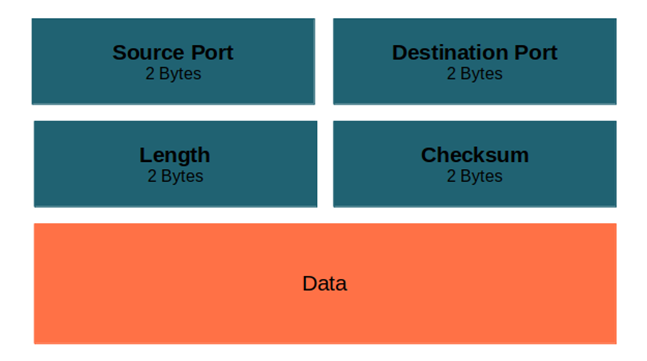

_Computer Network — a set of computers sharing resources located on or provided by network nodes_

# History of Computer Networks

* 1969 – ARPANET
* 1970-1974 – appearance of mini-computers and creating manually-configurable local networks
* 1974 – appearance of the first standardized network architecture IBM SNA and standardization X.25
* 1980-1985 – appearance of personal computers, Internet, TCP/IP, standard technologies for local network protocols Ethernet, FDDI, Token Ring
* 1986-1987 – commercial use of the Internet
* 1991 – appearance of Web protocol and first Websites
* 1995-2000 – development of Web and popularization of computers
* 2000-2010 – usage of wireless networks, reducing the cost of data transmission by thousands of times

## Network models

### OSI

* OSI (The Open System Interconnection model) — conceptual model of network protocol stack (reference model)

* Layers

  * Application

    * Specifies the shared communications protocols and interface methods used by hosts in a communications network

    * HTTP, SMTP, DNS, DHCP, SNMP, SSH, Telnet

  * Presentation

    * Serves as the data translator for the network

    * MIME, SSL

  * Session

    * Provides the mechanism for opening, closing and managing a session between end-user application processes

    * NetBIOS

  * Transport

    * Provides end-to-end communication services for applications

    * TCP, UDP

  * Network

    * Responsible for packet forwarding including routing through itermediate routers

    * IP, ICMP

  * Data Link

    * Transfers data between nodes on a network segment across the physical layer

    * Ethernet, ARP

  * Physical

    * Provides an electrical, mechanical, and procedural interface to the transmission medium
    
    * Ethernet, USB, Bluetooth

* Didn't become popular because of
  * Closed source development
  * Complexity of using (many layers)
  * Late appearance (doesn't take into account other technologies)

### TCP/IP

* Layers
  * Application
  * Transport
  * Internet
  * Network Access

# Physical layer

* Network Interface Controller (NIC, also called as Network Interface Card, Network Apadter, LAN adapter, Physical Network Interface) — computer hardware component that connects a computer to a computer network

## Encoding

* Encoding — process of converting given data to various patterns of voltage. For example, Manchester code

## Cables

|                     | Copper                                   | Optical fiber |
| ------------------- | ---------------------------------------- | ------------- |
| Bandwidth           | 10Mbs-10Gbs                              | 10Mbs-100Gbs  |
| Price               | $2.2/m                                   | $3/m          |
| Distance            | 1m-100m                                  | 1m-100km      |
| Noise               | Susceptible to EMI/RFI and voltage surge | Immune        |
| Equipment Price     | Low                                      | High          |
| Security            | Low                                      | High          |
| Exploitation Skills | Low                                      | High          |

* Copper cable
  * Drawbacks
    * Attenuation
    * Susceptible to EM and RF interference
  * Types
    * Unshielded Twisted-Pair
    * Shielded Twisted-Pair
    * Coaxial

* Optical fiber cable
  * Drawbacks
    * Fragile
  * Types
    * Single-mode optical fiber (SMF)
    * Multi-mode optical fiber (MMF)

## Wireless connection

* Drawbacks
  * Physical objects weaken the signals
  * Susceptible to interferences
  * Less secure than physical connections
  * Uses half-duplex mode

# Data Link layer

## Sublayers

* LLC (Logical Link Control) — sublayer that is the interface between the media access control sublayer and the network layer that provides multiplexing mechanisms, flow control and automatic repeat request (ARQ) error management mechanisms. Multiplexing mechanisms make it possible for several network protocols to coexist within a multipoint network and to be transported over the same network medium
* MAC (Media Access Control) — sublayer that controls the hardware responsible for interaction with the wired, optical or wireless transmission medium

## Topology

* Topology — arrangement of the elements (links, nodes, etc) of a communication network

### Physical Topology

* Physical topology — placement of the various components of a network
  * Describes device locations, used ports, interfaces, cables

### Logical Topology

* Logical topology — connections between devices in terms of device interfaces and IP addressing schemes
  * Describes how data flows within a network

### Types

* Point to Point (P2P)
* Bus Topology
* Ring Topology
* Star Topology
* Tree Topology
* Mesh Topology
* Hybrid Topology

## Transmission Modes

* Simplex — unidirectional communication
* Half-duplex — two-way directional communication but one at a time
* Full-duplex — two-way directional communication simultaneously

## Ethernet

### Frame

* Size — 64-1518 bytes
* Fields
  * Frame Start
  * Addressing
  * Type
  * Control
  * Data
  * Error Detection
  * Frame Stop
* Preamble — syncword that is used to synchronize a data transmission by indicating the end of header information and the start of data. Various techniquoes are used to avoid delimiter collision. For example, HDLC uses bit stuffing

### Addressing

* Addresses are updated by every device

* MAC address — unique identifier assigned to a network interface controller (NIC) for use as a network address in communications within a network segment (48 bits)
  * Unicast/Multicast (defined by least significant bit of an address's first octet)

### ARP

* ARP — protocol used for discovering the link layer address, such as a MAC address, associated with a given internet layer address
* Example of usage: source computer sends broadcast message with certain IP address and computer which has this IP address responds with his MAC address

### Network Hub

* Network Hub — network hardware device that connects multiple devices together and making them act as a single network segment
  * Operates on the Physical layer
  * Half-duplex cables
  * Works with electrical signals
  * Every device except source receives signal. Devices check whether destination address is equal to MAC address saved in their RAM

### Network Switch

* Network Switch — network hardware device that connects devices on a computer network by using packet switching to receive and forwards data to the destination device

  * Operates on the Data Link layer
  * Full-duplex cables
  * Works with frames and packets
  * Uses MAC addresses to forward data
  * Some switches can also forward data at the network layer by additionally incorporating routing functionality (layer-3 switches or multilayer switches)
* Modes

  * Store-and-Forward
    * Receives the data frame and then checks for errors before forwarding the packets
  * Cut-through
    * Forwards the packets as soon as the destination address is available without waiting for the rest of the data to arrive
  * Fragment-free
    * Works as Cut-through but reads at least 64 bytes of the frame before switching it to avoid forwarding Ethernet runt frames (frames smaller than 64 bytes)

# Network layer

### Network Router

* Network Router — network hardware device that forwards data packets between computer networks
  * Operates on the Network layer
  * Half-duplex
  * Works with packets
  * Uses IP address to forward data
  * Work within both wired and wireless network situations
  * Offer NAT, NetFlow, QoS services
  * Used in MAN, WAN

#### Routing Table

* Routing Table — data table stored in a router or a network host that lists the routes to particular network destinations, and in some cases metrics (distances) associated with those routes
* Fields
  * Route Source
    * L — address of router's interface
    * C — direct connected network
    * S — static route
    * O/D/R — route received dynamically from another router using OSPF/EIGRP/RIP routing protocol
    * \* — candidate for default route
  * Destination Network
  * Administrative Distance
    * Number that is used to rank routes
  * Metric
    * Number that is calculated by a routing algorithm and is used to rank routes
  * Next-Hop
  * Route Timestamp
    * Timestamp from when the route appeared in the table
  * Outgoing Interface

|                    | Static Routing         | Dynamic Routing                          |
| ------------------ | ---------------------- | ---------------------------------------- |
| Complexity         | Linear to network size | Constant                                 |
| Topology Update    | Manual                 | Automatic                                |
| Scalability        | Low                    | High                                     |
| Security           | By default             | Require set up                           |
| Hardware Resources | Not required           | Need CPU, RAM, throughput                |
| Working Result     | Defined manually       | Depends on topology and routing protocol |

#### NAT

* NAT (Network address translation) — method of mapping an IP address space into another by modifying network address information in the IP header of packets while they are in transit across a traffic routing device

* Types

  * One-to-one — map one private IP address to one publicly exposed IP address

    * Used to interconnect two IP networks that have incompatible addressing

  * One-to-many — map multiple private hosts to one publicly exposed IP address

    * NAPT/PAT — use the port numbers to distinguish hosts (TCP/UDP)

    * Protocols not based on TCP and UDP require other translation techniques

* Translation methods

  * Full-cone (one-to-one NAT) — External host can send packets using provided external address
  * Address-restricted-cone — External host can send packets from _any_ port only if previously received packet from provided external address
  * Port-restricted cone — External host can send packets from _specific_ port only if previously received packet from provided external address on this port

  * Symmetric — Unique external address for every combination of internal IP address and destination IP address. External host can send packets only if previously received packet from provided external address

# Transport layer

## Ports

* Port — number assigned to uniquely identify a connection endpoint and to direct data to a specific service

* Network Socket — software structure within a network node of a computer network that services as an endpoint for sending and receiving data across the network
* Groups
  * Well-known port numbers (0-1023)
  * Ephemeral ports (1024-65535)

## TCP

* Features
  * Session
  * Reliable message delivery
  * Ordered message delivery
  * Dynamic data transmission flow managing
* Fields

* Usage
  * HTTP
  * FTP
  * SMTP
  * SSH

### Connection

### Flags

* SYN — synchronisation flag is used for synchronizing sequence number. The first packet from sender as well as receiver should have this flag set
* ACK — acknowledgement flag is used to acknowledge packets which are successful received by the host
* FIN — finished flag is used to request for connection termination. The last packet sent by sender has this flag set
* RST — reset flag is used to terminate the connection if the RST sender received a packet it didn't expect
* URG — urgent flag is used to notify the receiver to process the urgent packets before processing all other packets
* PSH — push flag is used to tell the receiver to process these packets  as they are received instead of buffering them 

## UDP

* Fields

* Usage
  * DHCP
  * DNS
  * SNMP
  * TFTP
  * VoIP
  * Video Conferencing

# Application layer

## DHCP

* DHCP (Dynamic Host Configuration Protocol) — network management protocol used on Internet Protocol networks for automatically assigning IP addresses and other communication parameters to devices connected to the network using a client-server architecture

## DNS

* DNS (Domain Name System) — hierarchical and distributed naming system for computers, services, and other resources in the Internet or other Internet Protocol networks

* Features
  * Distributed administraion
  * Distributed data storage
  * Caching
  * Hierarchical structure
  * Reservation
* Record Types
  * A (address) — points a domain name to IPv4 address
  * AAAA — points a domain name to IPv6 address
  * CNAME (canonical name) — points a domain name (an alias) to another domain
  * NS (nameserver) — points a domain name to authoritative DNS server
  * MX (mail exchange) — points a domain name to where emails should be routed to
  * TXT (text) — points a domain name to text
  * PTR (pointer) — points IP address to domain name

## NTP

* NTP (Network Time Protocol) — network protocol for clock synchronization between computer systems over packet-switched, variable-latency data networks
* NTS (Network Time Security) — secure version of NTP with TLS and AEAD

# VPN

* VPN (Virtual Private Network) — technology that extends a private network across a public network and enables users to send and receive data across shared or public networks  as if thesir computing devices were directly connected to the private network
* Types
  * Provider-based
    * L2VPN
    * L3VPN
  * Client-based
    * Site-to-Site
    * Remote Access
* Usage
  * Communication between services and central server through VPN
  * Communication between organisations through encrypted VPN

## Site-to-Site

* Protocols
  * GRE
  * IPsec
  * IP in IP

### GRE

* GRE (Generic Routing Encapsulation) — tunneling protocol that can encapsulate a wide variety of network protocols inside virtual point-to-point links or point-to-multipoint links over an Internet Protocol network
* Features
  * Point-to-Point
  * Over IP (hides original IP addresses)
  * Unicast, multicast, broadcast
  * No encryption

* Has problem with fragmentation caused by reaching MTU because protocol adds new IP addresses in packet
  * Solution: decrease tunnel's MTU and decrease MSS (TCP)
  * Solution 2: PMTUD (Path MTU Discovery)

## Remote Access

* Protocols
  * PPTP
  * L2TP
  * IPsec
  * SSL/TLS

## DMVPN

* DMVPN (Dynamic Multipoint Virtual Private Network) — dynamic tunneling form of a virtual private network
* Features
  * Dynamic building of full-Mesh topologies
  * Reduce load of central router
  * Encryption via IPsec
  * Ability to use routing protocols
* Components
  * mGRE (multipoint GRE)
  * NHRP (Next Hop Resolution Protocol)
  * Routing (OSPF, EIGRP, BGP)
  * IPsec (Internet Protocol Security)

* Usage
  * Communication between large number of geo-distributed services and central server

### NHRP

* NHRP (Next Hop Resolution Protocol) — extension of the ATM ARP routing mechanism that is sometimes used to improve efficiency of routing computer network traffic over Non-Broadcast Multiple Access Networks (NMBA)

* Definitions

  * HUB router — central router
  * Spoke router — non-central routers
  * NHS (Next Hop Server) — HUB router
  * NHC (Next Hop Client) —  Spoke router

* Implementation

  * Makes and stores table of mapping real addresses to virtual ones in HUB router
  * When Spoke router is registered in HUB router it appears in table and it's announced to other Spoke routers

* Phases

  1. Hub-to-Spoke — whole traffic through HUB

  2. Spoke-to-Spoke — traffic can be sended bypassing HUB

  3. Spoke-to-Spoke (hierarchical)

# TLS

* TLS (Transport Layer Security) — cryptographic protocol designed to provide communications security over a computer network

  * SSL (Security Sockets Layer) — network protocol used  for the secure transmission of documents over a network [deprecated]
  * DTLS (Datagram Transport Layer Security) — communnications protocol providing security to datagram-based applications

* History

  | Protocol |  Published  |                            Status                            |
  | :------: | :---------: | :----------------------------------------------------------: |
  | SSL 1.0  | Unpublished |                         Unpublished                          |
  | SSL 2.0  |    1995     | Deprecated in 2011 (RFC [6176](https://datatracker.ietf.org/doc/html/rfc6176)) |
  | SSL 3.0  |    1996     | Deprecated in 2015 (RFC [7568](https://datatracker.ietf.org/doc/html/rfc7568)) |
  | TLS 1.0  |    1999     | Deprecated in 2021 (RFC [8996](https://datatracker.ietf.org/doc/html/rfc8996)) |
  | TLS 1.1  |    2006     | Deprecated in 2021 (RFC [8996](https://datatracker.ietf.org/doc/html/rfc8996)) |
  | TLS 1.2  |    2008     |                      In use since 2008                       |
  | TLS 1.3  |    2018     |                      In use since 2018                       |

## Authentication

* Authentication — act of proving an assertion, such as the identity of a computer system user
* Ways
  * One-way — only one side proves identity
  * Two-way (mutual) — both client and server prove identities
* Types
  * Accepting proof of identity given by a credible person who has first-hand evidence that the identity is genuine
  * Comparing the attributes of the object itself to what is known about objects of that origin
  * Relies on documentation or other external affirmations
* Levels
  * Single-Factor Authentication (SFA)
  * Two-Factor Authentication (2FA)
  * Multi-Factor Authentication (MFA)

### Authentication Factors

* Authentication Factor — special category of security credential that is used to verify the identity and authorization of a user attempting to gain access, send communcations, or request data from a secured network, system or application
* Categories
  * Knowledge factors — something the user _knows_ (password, passphrase, PIN)
  * Possession factors (ownership factors) — something the user _has_ (ID card, security token, cell phone holding a software token)
  * Inherence factors — something the user _is_ or _does_ (fingerprint, retinal pattern, signature, face, voice)
  * Location factors — something where the user is _located_ (city, country)
  * Behaviour factors — something the user is _required to do_ (draw a specific pattern onto a grid of dots)

### TLS/SSL Certificates

* TLS/SSL certificate — digital certificate that certifies the ownership of a public key by the named subject of the certificate, and indicates certain expected usages of that key
* TLS typically relies on a set of trusted thid-party CAs (certificate authorities) which is present in the trusted store of the device to establish the authenticity of certificates
* TLS uses X.509 certificate's standard

#### Revocation

_Checking the revocation status of TLS/SSL certificates is ongoing problem in web security_

* CRL (Certificate Revocation List) — list of digital certificates that have been revoked by the issuing certificate authority before their scheduled expiration date and should no longer be trusted
* OCSP (Online Certificate Status Protocol) — protocol used for obtaining the revocation status of an X.509 digital certificate
  * OSCP queries fail so often and are impossible in some situations

* Approaches

  * Google Chrome: relies on CRLSet

    CRLSet — list of revoked certificates which is pushed to the browser as a software update

  * Mozilla Firefox: relies on OneCRL + OCSP in "soft-fail" mode

    OneCRL — list of revoked certificates which is pushed to the browser as a software update

  * Apple Safari: list of revoked certificates + OSCP _only_ for entities which are present in this list

  * Microsoft Edge: relies on CRLSet

    Though Windows is set to check for certificate revocation by default in Internet Properties, Microsoft Edge doesn't follow these settings

# HTTP

* HTTP (Hypertext Transfer Protocol) — applicaiton layer protocol in the Internet protocol suite model for distributed, collaborative, hypermedia information systems

| Version  | Year Introduced | Current Status |
| :------: | :-------------: | :------------: |
| HTTP/0.9 |      1991       |    Obsolete    |
| HTTP/1.0 |      1996       |    Obsolete    |
| HTTP/1.1 |      1997       |    Standard    |
|  HTTP/2  |      2015       |    Standard    |
|  HTTP/3  |      2022       |    Standard    |

## Methods

| Request method | Request has payload body | Response has payload body | Safe | Idempotent | Cacheable |
| :------------: | :----------------------: | :-----------------------: | :--: | :--------: | :-------: |
|      GET       |         Optional         |            Yes            | Yes  |    Yes     |    Yes    |
|      HEAD      |         Optional         |            No             | Yes  |    Yes     |    Yes    |
|      POST      |           Yes            |            Yes            |  No  |     No     |    Yes    |
|      PUT       |           Yes            |            Yes            |  No  |    Yes     |    No     |
|     DELETE     |         Optional         |            Yes            |  No  |    Yes     |    No     |
|    CONNECT     |         Optional         |            Yes            |  No  |     No     |    No     |
|    OPTIONS     |         Optional         |            Yes            | Yes  |    Yes     |    No     |
|     TRACE      |            No            |            Yes            | Yes  |    Yes     |    No     |
|     PATCH      |           Yes            |            Yes            |  No  |     No     |    No     |

## Status Codes

- *1xx informational response* – request was received, continuing process
- *2xx successful* – request was successfully received, understood, and accepted
- *3xx redirection* – further action needs to be taken in order to complete the request
- *4xx client error* – request contains bad syntax or cannot be fulfilled
- *5xx server error* – server failed to fulfil an apparently valid request

## Content Negotiation

* Content Negotiation — mechanisms that make it possible tos erve different versions of a document at the same URI
* Mechanisms
  * Server-Driven (proactive) — user-agent informs the server what representations it understands
  * Agent-Driven (active) — server informs user-agent which representations it has available
  * Transparent — server informs user-agent about multiple choices of representation using HTTP response with 300 status code
  * Hybrid combinations — combines multiple mechanisms

## Related Technologies

* ZBF / ZFW (Zone-Based Firewall) — method of traffic filtering that prevents data transition between zones and works over application layer protocols, e.g. HTTP
* Traffic Prioritizing
* L7 Load Balancing (e.g. NGINX, HAProxy)

# Data Center Networks

## Definitions

* North-South traffic — network traffic coming in and out of the data center

* East-West traffic — network traffic within the data center
* Unknown-unicast traffic — unicast traffic received by switcher which is intended to be delivered to a destination that is not in its forwarding information base
  * In this case the switch marks the frame for flooding and sends it to all forwarding ports within the respective VLAN
* Oversubscription  — practice of committing more network bandwidth to devices connected to that network than what is physically available

## Current requirements

* East-West traffic oriented design (most of traffic is East-West, ~73%)
* Fast scalability
* Fast increase of network throughput
* High fault-tolerance
* Works at DC with no impact on services

## Architecture

### Traditional 3-Tier Architecture

​                              

* Levels
  * Core — layer that provides the high-speed packet switching backplane, resilient L3 routed fabric with no single point of failure and load balancing, it runs interior routing protocol, such as OSPF or EIGRP
  * Aggregation — layer that provides important functions, such as service module integration, L2 domain definitions, SPT processing, firewall, load balancing, content switching, TLS offloading, intrusion detection, network analysis, default gateway redundancy and more
  * Access — layer where the servers physically attach to the network

* Benefits
  * Optimal for North-South traffic
  * Simple configuration
  * Low cost for commutation
* Drawbacks
  * Non-optimal for East-West traffic
  * No scalability
  * Unknown unicast flood
  * Risk of appearance of loops
  * Lack of VLANs
  * Difficulties at work with nodes above Access level
  * Difficulties with reserving channels and nodes

### 2-Tier Spine-Leaf Architecture

​                                

* Levels
  * Spine Switch — L3 switch connected to leaf switchers and make mesh network
  * Leaf Switch (ToR Switch) — L2 switch on top of rack (can also be in the middle/bottom)
* Benefits
  * Optimal for East-West traffic
  * No STP
  * Increased use of fixed port switches over modular models for the network backbone
  * Scale-out
* Drawbacks
  * Non-optimal for North-South traffic
  * Each leaf is separate L3 network
  * Adding overlay increase complexity
  * Difficulties with oversubscription
* Best practicies
  * Do not expand channels between Leaves, Spines and SuperSpines using LAG interface, it's better to add Spine or SuperSpine
    * Why? -One link break leads bigger losses
  * Spine is a trivial node, only routing function
    * Why? -Break of one of Spines with increased load leads to bigger losses

#### Network layers

​             

* Underlay layer — layer that represents physical network state, it comprises L1-L3 network, routing protocols, commutation and all physical connections within network
* Overlay layer  — layer that represents logic network state, it comprises connections between endpoints
  * Network-Based — when Leaf (ToR) switchers know about services under them
    * Good performance
    * Expensive switchers
  * Host-Based —when hosts know how to communicate with each other
    * Bad performance
    * Cheap switchers
    * No support of vendor is required

# VxLAN

* VXLAN (Virtual Extensible LAN) — network virtualization technology that uses VLAN-like encapsulation technique to encapsulate OSI layer 2 Ethernet frames within UDP datagrams with  4789 port and attempts to address the scalabilty problems associated with large cloud computing deployment
* VTEP (VXLAN tunnel endpoint) — endpoint in VXLAN overlay network
* SVI (Switch Virtual Interface) — logical layer-3 interface on a switch that allows traffic to be routed between VLANs by providing gateway for the VLAN

## Traffic Forwarding

### Unicast

* Algorithm

  * Source VTEP encapsulates the Ethernet frame in the VXLAN/UDP/IP header

    Source/Destination IP address – VTEP's VXLAN tunnel source/destination IP address

  * Source VTEP forwards the encapsulated packet out of the outgoing VXLAN tunnel interface found in the VSI's MAC address table

  * The intermediate transport devices (P devices) forward the frame to the destination VTEP by using the outer IP header

  * The destination VTEP removes the headers on top of the inner Ethernet frame then it performs MAC address table lookup in the VXLAN's VSI to forward the frame out of the matching outgoing interface

### Flood

_VTP floods broadcast, multicast, or unknown unicast frame to all site-facing interfaces and VXLAN tunnels in the VXLAN, excpet for the incoming interface_

* Unicast mode (head-end replication) — mode in which source VTEP replicates the flood frame and then sends one replica for each destination IP address
* Multicast mode (tandem replication) — mode in which source VTEP sends the flood frame in a multicast VXLAN packet, transport network devices replicate and forward the packet to remote VTEP's based on their multicast forwarding entries
* Flood Proxy mode — mode in which source VTEP sends the flood frame in a VXLAN packet over a VXLAN tunnel to a flood proxy server which replicates and forwards the packet to each remote VTEP through its VXLAN tunnels

### VXLAN EVPN

* EVPN — extension to Border Gateway Protocol (BGP) that allows the network to carry endpoint reachability information such as Layer 2 MAC addresses and Layer 3 IP address
* Benefits
  * Increased Scale
  * Increased Stability
  * Distributed Anycast Gateway
  * Increased Security
